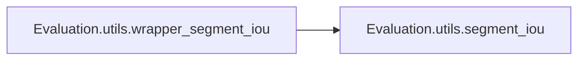

# Evaluation Utils

[_Documentation generated by Documatic_](https://www.documatic.com)

<!---Documatic-section-Codebase Structure-start--->
## Codebase Structure

<!---Documatic-block-system_architecture-start--->
```mermaid
None
```
<!---Documatic-block-system_architecture-end--->

# #
<!---Documatic-section-Codebase Structure-end--->

<!---Documatic-section-Evaluation.utils.get_blocked_videos-start--->
## Evaluation.utils.get_blocked_videos

<!---Documatic-section-get_blocked_videos-start--->
### Summary

Get a list of blocked videos.

<!---Documatic-block-Evaluation.utils.get_blocked_videos-start--->
<details>
	<summary><code>Evaluation.utils.get_blocked_videos</code> code snippet</summary>

```python
def get_blocked_videos(api=API):
    api_url = '{}?action=get_blocked'.format(api)
    req = urllib2.Request(api_url)
    response = urllib2.urlopen(req)
    return json.loads(response.read())
```
</details>
<!---Documatic-block-Evaluation.utils.get_blocked_videos-end--->
<!---Documatic-section-get_blocked_videos-end--->

# #
<!---Documatic-section-Evaluation.utils.get_blocked_videos-end--->

<!---Documatic-section-Evaluation.utils.interpolated_prec_rec-start--->
## Evaluation.utils.interpolated_prec_rec

<!---Documatic-section-interpolated_prec_rec-start--->
### Summary

Calculate the interpolated accuracy of a record.

<!---Documatic-block-Evaluation.utils.interpolated_prec_rec-start--->
<details>
	<summary><code>Evaluation.utils.interpolated_prec_rec</code> code snippet</summary>

```python
def interpolated_prec_rec(prec, rec):
    mprec = np.hstack([[0], prec, [0]])
    mrec = np.hstack([[0], rec, [1]])
    for i in range(len(mprec) - 1)[::-1]:
        mprec[i] = max(mprec[i], mprec[i + 1])
    idx = np.where(mrec[1:] != mrec[0:-1])[0] + 1
    ap = np.sum((mrec[idx] - mrec[idx - 1]) * mprec[idx])
    return ap
```
</details>
<!---Documatic-block-Evaluation.utils.interpolated_prec_rec-end--->
<!---Documatic-section-interpolated_prec_rec-end--->

# #
<!---Documatic-section-Evaluation.utils.interpolated_prec_rec-end--->

<!---Documatic-section-Evaluation.utils.segment_iou-start--->
## Evaluation.utils.segment_iou

<!---Documatic-section-segment_iou-start--->
### Summary

Calculate the Iou distance between two segments.

<!---Documatic-block-Evaluation.utils.segment_iou-start--->
<details>
	<summary><code>Evaluation.utils.segment_iou</code> code snippet</summary>

```python
def segment_iou(target_segment, candidate_segments):
    tt1 = np.maximum(target_segment[0], candidate_segments[:, 0])
    tt2 = np.minimum(target_segment[1], candidate_segments[:, 1])
    segments_intersection = (tt2 - tt1).clip(0)
    segments_union = candidate_segments[:, 1] - candidate_segments[:, 0] + (target_segment[1] - target_segment[0]) - segments_intersection
    tIoU = segments_intersection.astype(float) / segments_union
    return tIoU
```
</details>
<!---Documatic-block-Evaluation.utils.segment_iou-end--->
<!---Documatic-section-segment_iou-end--->

# #
<!---Documatic-section-Evaluation.utils.segment_iou-end--->

<!---Documatic-section-Evaluation.utils.wrapper_segment_iou-start--->
## Evaluation.utils.wrapper_segment_iou

<!---Documatic-section-wrapper_segment_iou-start--->


### Summary

Wrapper for segment_iou.

### Object Calls

* Evaluation.utils.segment_iou

<!---Documatic-block-Evaluation.utils.wrapper_segment_iou-start--->
<details>
	<summary><code>Evaluation.utils.wrapper_segment_iou</code> code snippet</summary>

```python
def wrapper_segment_iou(target_segments, candidate_segments):
    if candidate_segments.ndim != 2 or target_segments.ndim != 2:
        raise ValueError('Dimension of arguments is incorrect')
    (n, m) = (candidate_segments.shape[0], target_segments.shape[0])
    tiou = np.empty((n, m))
    for i in xrange(m):
        tiou[:, i] = segment_iou(target_segments[i, :], candidate_segments)
    return tiou
```
</details>
<!---Documatic-block-Evaluation.utils.wrapper_segment_iou-end--->
<!---Documatic-section-wrapper_segment_iou-end--->

# #
<!---Documatic-section-Evaluation.utils.wrapper_segment_iou-end--->

[_Documentation generated by Documatic_](https://www.documatic.com)