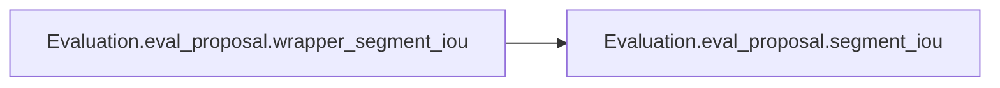
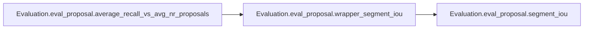

# Evaluation Eval Proposal

[_Documentation generated by Documatic_](https://www.documatic.com)

<!---Documatic-section-Codebase Structure-start--->
## Codebase Structure

<!---Documatic-block-system_architecture-start--->
```mermaid
None
```
<!---Documatic-block-system_architecture-end--->

# #
<!---Documatic-section-Codebase Structure-end--->

<!---Documatic-section-Evaluation.eval_proposal.interpolated_prec_rec-start--->
## Evaluation.eval_proposal.interpolated_prec_rec

<!---Documatic-section-interpolated_prec_rec-start--->
### Summary

Calculate the interpolated accuracy of a record.

<!---Documatic-block-Evaluation.eval_proposal.interpolated_prec_rec-start--->
<details>
	<summary><code>Evaluation.eval_proposal.interpolated_prec_rec</code> code snippet</summary>

```python
def interpolated_prec_rec(prec, rec):
    mprec = np.hstack([[0], prec, [0]])
    mrec = np.hstack([[0], rec, [1]])
    for i in range(len(mprec) - 1)[::-1]:
        mprec[i] = max(mprec[i], mprec[i + 1])
    idx = np.where(mrec[1:] != mrec[0:-1])[0] + 1
    ap = np.sum((mrec[idx] - mrec[idx - 1]) * mprec[idx])
    return ap
```
</details>
<!---Documatic-block-Evaluation.eval_proposal.interpolated_prec_rec-end--->
<!---Documatic-section-interpolated_prec_rec-end--->

# #
<!---Documatic-section-Evaluation.eval_proposal.interpolated_prec_rec-end--->

<!---Documatic-section-Evaluation.eval_proposal.segment_iou-start--->
## Evaluation.eval_proposal.segment_iou

<!---Documatic-section-segment_iou-start--->
### Summary

Calculate the Iou distance between two segments.

<!---Documatic-block-Evaluation.eval_proposal.segment_iou-start--->
<details>
	<summary><code>Evaluation.eval_proposal.segment_iou</code> code snippet</summary>

```python
def segment_iou(target_segment, candidate_segments):
    tt1 = np.maximum(target_segment[0], candidate_segments[:, 0])
    tt2 = np.minimum(target_segment[1], candidate_segments[:, 1])
    segments_intersection = (tt2 - tt1).clip(0)
    segments_union = candidate_segments[:, 1] - candidate_segments[:, 0] + (target_segment[1] - target_segment[0]) - segments_intersection
    tIoU = segments_intersection.astype(float) / segments_union
    return tIoU
```
</details>
<!---Documatic-block-Evaluation.eval_proposal.segment_iou-end--->
<!---Documatic-section-segment_iou-end--->

# #
<!---Documatic-section-Evaluation.eval_proposal.segment_iou-end--->

<!---Documatic-section-Evaluation.eval_proposal.wrapper_segment_iou-start--->
## Evaluation.eval_proposal.wrapper_segment_iou

<!---Documatic-section-wrapper_segment_iou-start--->


### Summary

Wrapper for segment_iou.

### Object Calls

* Evaluation.eval_proposal.segment_iou

<!---Documatic-block-Evaluation.eval_proposal.wrapper_segment_iou-start--->
<details>
	<summary><code>Evaluation.eval_proposal.wrapper_segment_iou</code> code snippet</summary>

```python
def wrapper_segment_iou(target_segments, candidate_segments):
    if candidate_segments.ndim != 2 or target_segments.ndim != 2:
        raise ValueError('Dimension of arguments is incorrect')
    (n, m) = (candidate_segments.shape[0], target_segments.shape[0])
    tiou = np.empty((n, m))
    for i in range(m):
        tiou[:, i] = segment_iou(target_segments[i, :], candidate_segments)
    return tiou
```
</details>
<!---Documatic-block-Evaluation.eval_proposal.wrapper_segment_iou-end--->
<!---Documatic-section-wrapper_segment_iou-end--->

# #
<!---Documatic-section-Evaluation.eval_proposal.wrapper_segment_iou-end--->

<!---Documatic-section-Evaluation.eval_proposal.average_recall_vs_avg_nr_proposals-start--->
## Evaluation.eval_proposal.average_recall_vs_avg_nr_proposals

<!---Documatic-section-average_recall_vs_avg_nr_proposals-start--->


### Summary

Average recall vs average number of proposals per video.

### Object Calls

* Evaluation.eval_proposal.wrapper_segment_iou

<!---Documatic-block-Evaluation.eval_proposal.average_recall_vs_avg_nr_proposals-start--->
<details>
	<summary><code>Evaluation.eval_proposal.average_recall_vs_avg_nr_proposals</code> code snippet</summary>

```python
def average_recall_vs_avg_nr_proposals(ground_truth, proposals, max_avg_nr_proposals=None, tiou_thresholds=np.linspace(0.5, 0.95, 10)):
    video_lst = ground_truth['video-id'].unique()
    if not max_avg_nr_proposals:
        max_avg_nr_proposals = float(proposals.shape[0]) / video_lst.shape[0]
    ratio = max_avg_nr_proposals * float(video_lst.shape[0]) / proposals.shape[0]
    ground_truth_gbvn = ground_truth.groupby('video-id')
    proposals_gbvn = proposals.groupby('video-id')
    score_lst = []
    total_nr_proposals = 0
    for videoid in video_lst:
        proposals_videoid = proposals_gbvn.get_group(videoid)
        this_video_proposals = proposals_videoid.loc[:, ['t-start', 't-end']].values
        sort_idx = proposals_videoid['score'].argsort()[::-1]
        this_video_proposals = this_video_proposals[sort_idx, :]
        ground_truth_videoid = ground_truth_gbvn.get_group(videoid)
        this_video_ground_truth = ground_truth_videoid.loc[:, ['t-start', 't-end']].values
        if this_video_proposals.shape[0] == 0:
            n = this_video_ground_truth.shape[0]
            score_lst.append(np.zeros((n, 1)))
            continue
        if this_video_proposals.ndim != 2:
            this_video_proposals = np.expand_dims(this_video_proposals, axis=0)
        if this_video_ground_truth.ndim != 2:
            this_video_ground_truth = np.expand_dims(this_video_ground_truth, axis=0)
        nr_proposals = np.minimum(int(this_video_proposals.shape[0] * ratio), this_video_proposals.shape[0])
        total_nr_proposals += nr_proposals
        this_video_proposals = this_video_proposals[:nr_proposals, :]
        tiou = wrapper_segment_iou(this_video_proposals, this_video_ground_truth)
        score_lst.append(tiou)
    pcn_lst = np.arange(1, 101) / 100.0 * (max_avg_nr_proposals * float(video_lst.shape[0]) / total_nr_proposals)
    matches = np.empty((video_lst.shape[0], pcn_lst.shape[0]))
    positives = np.empty(video_lst.shape[0])
    recall = np.empty((tiou_thresholds.shape[0], pcn_lst.shape[0]))
    for (ridx, tiou) in enumerate(tiou_thresholds):
        for (i, score) in enumerate(score_lst):
            positives[i] = score.shape[0]
            true_positives_tiou = score >= tiou
            pcn_proposals = np.minimum((score.shape[1] * pcn_lst).astype(np.int), score.shape[1])
            for (j, nr_proposals) in enumerate(pcn_proposals):
                matches[i, j] = np.count_nonzero(true_positives_tiou[:, :nr_proposals].sum(axis=1))
        recall[ridx, :] = matches.sum(axis=0) / positives.sum()
    avg_recall = recall.mean(axis=0)
    proposals_per_video = pcn_lst * (float(total_nr_proposals) / video_lst.shape[0])
    return (recall, avg_recall, proposals_per_video)
```
</details>
<!---Documatic-block-Evaluation.eval_proposal.average_recall_vs_avg_nr_proposals-end--->
<!---Documatic-section-average_recall_vs_avg_nr_proposals-end--->

# #
<!---Documatic-section-Evaluation.eval_proposal.average_recall_vs_avg_nr_proposals-end--->

[_Documentation generated by Documatic_](https://www.documatic.com)